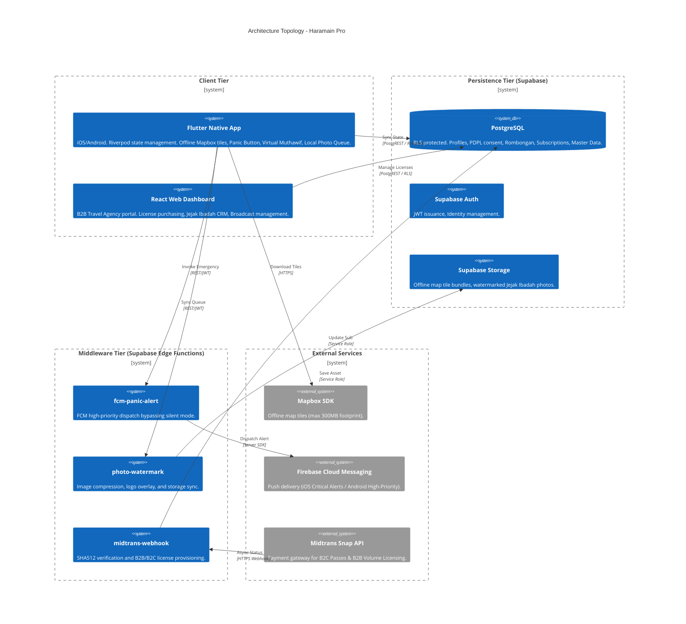
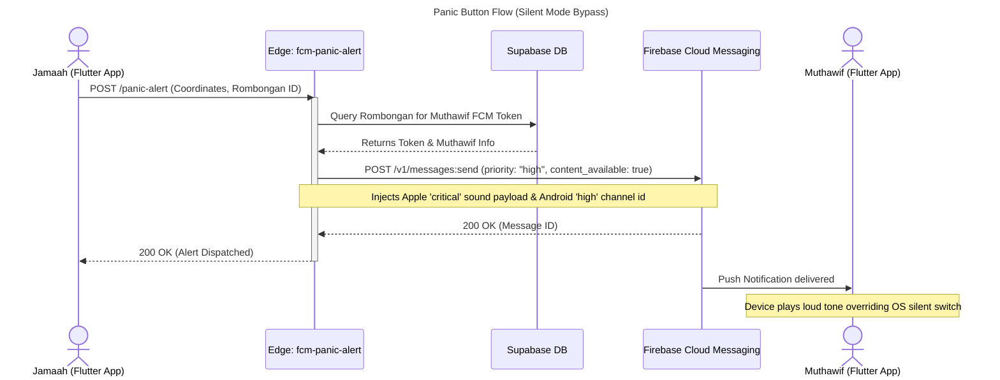
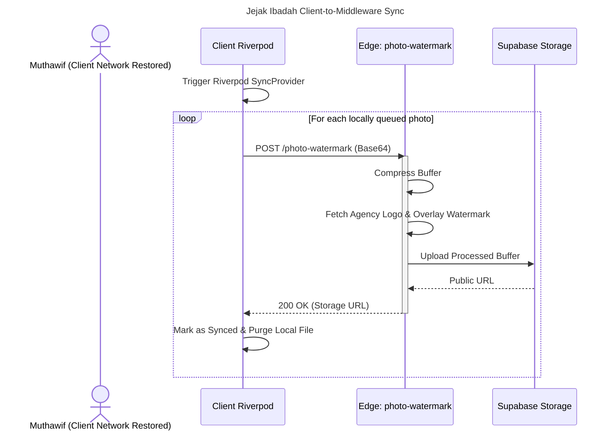
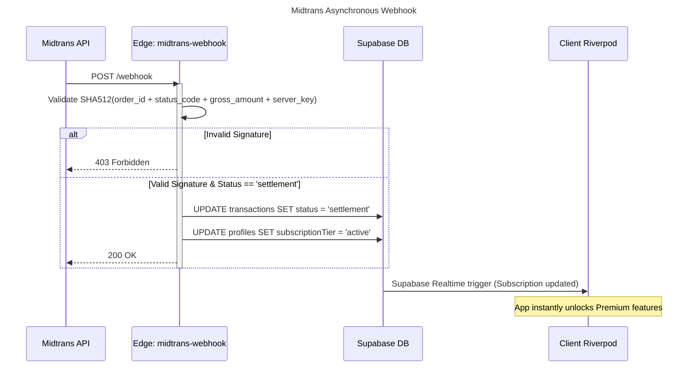

# Project

## Product Specification - Haramain Pro

### Product Intent and Boundaries
Haramain Pro is a native mobile application \(Flutter iOS/Android\) and companion B2B web dashboard designed to be a "Smart Companion" for Umrah and Hajj pilgrims\. It solves the critical safety risks of pilgrims getting lost in massive crowds without internet access, and the business challenge of travel agencies struggling to differentiate their packages and retain alumni\.

The product operates as a B2B2C flywheel\. Travel agencies purchase and distribute the app to differentiate their service\. Pilgrims use the app for offline safety and location\-based prayers, generating a shared digital album \("Jejak Ibadah"\)\. This album serves as the travel agency's primary CRM and retention engine for post\-trip marketing\.

The product boundary strictly encompasses offline GPS navigation, emergency alerting, subscription access management, location\-contextual prayer surfacing, and post\-trip photo CRM\. The product explicitly delegates payment processing to Midtrans and cross\-platform deep\-linking to native OS features \(e\.g\., WhatsApp\)\. The product does not handle official Saudi visa processing, Nusuk facility bookings, or real\-time generative AI voice interactions\.

### Actors, Stakeholders and Operating Context
The operating context is defined by the harsh physical environment of Makkah and Madinah, where cellular networks are frequently congested, internet access is unreliable, and pilgrim devices are routinely placed in silent or Do Not Disturb modes\.

**B2C Pilgrim:** The primary end\-user executing the Umrah or Hajj journey\. They require offline safety tools, navigation, and prayer guides\. Their physical safety and willingness to cross a paywall dictate the native mobile application requirements\.

**B2B Travel Agency:** The business entity utilizing the web dashboard to purchase wholesale licenses, assign group leaders, and extract post\-trip CRM value from generated photo galleries\.

**Muthawif:** The designated group leader\. They operate in the field, coordinating pilgrims, broadcasting itineraries, managing emergencies, and capturing agency\-watermarked photos\.

**System Admin:** The internal operator of the platform responsible for overseeing trial periods, updating Saudi regulations in the system, and managing global test states\.

**Development Team:** The engineers and reviewers building the product\. They require explicit product capabilities to rapidly verify hardware\-dependent features \(offline maps, silent\-mode overrides\) without traveling to Makkah or processing real credit cards\.

**Saudi Data Regulators \(SDAIA\):** The regulatory authority enforcing the Personal Data Protection Law \(PDPL\)\. Their requirements dictate strict product\-level consent gates, data deletion flows, and National Register of Controllers \(NRC\) readiness\.

### Product Capabilities and Workflows
#### B2C Pilgrim Safety, Navigation and Monetization
The application must cache Mapbox offline map tiles covering the Makkah and Madinah city limits directly to the device storage\.

The offline map storage footprint must be constrained to a maximum of 300MB to accommodate devices with limited capacity\.

The application must provide a prominent Panic Button that captures the user's offline GPS coordinates and dispatches a high\-priority FCM payload to the assigned Muthawif\.

The high\-priority FCM payload must be configured to bypass iOS and Android OS\-level silent and Do Not Disturb modes on the receiving device\.

The application must feature a Virtual Muthawif module that detects proximity to predefined geographic boundaries \(e\.g\., Ka'bah, Sa'i, Raudhah\) and automatically surfaces the relevant contextual prayer text in Arabic, Latin, and the local translation\.

The application must force all new B2C users through a mandatory onboarding flow requiring explicit opt\-in consent for location tracking and sensitive biometric/passport data processing to comply with Saudi PDPL\.

The application must provide a dedicated interface in the settings menu allowing users to instantly withdraw PDPL consent and request local and server\-side data deletion\.

The application must grant a 7\-day free trial of premium features \(Offline Maps, Panic Button\) upon initial registration\.

The application must display a persistent visual countdown indicating the remaining days in the free trial\.

The application must enforce a strict paywall immediately upon trial expiration, blocking access to premium features\.

The paywall must present the "Haramain Safety Pass" at a price of Rp 120,000 for a single lifetime license\.

The paywall interface must prominently feature psychological conversion hooks, explicitly stating a "100% Peace of Mind or Money Back Guarantee" and "Lifetime Access"\.

The application must integrate Midtrans Snap to process the Rp 120,000 transaction\.

The application must instantly unlock premium features upon receiving an asynchronous success webhook from Midtrans\.

The system must automatically purge offline GPS tracking history 30 days after the associated Umrah trip end date to comply with Saudi PDPL storage limitation principles\. Extended retention \(e\.g\., for personal albums\) requires a separate explicit user consent\.

#### B2B Travel Agency Licensing and CRM Dashboard
Where:

The web dashboard must allow a B2B Travel Agency to register by uploading their official PPIU license number and a high\-resolution agency logo\.

The web dashboard must allow agencies to purchase "Seat Licenses" in bulk via a Midtrans checkout flow\.

The licensing engine must apply automatic volume discounts based on the number of pax purchased in a single transaction\.

The total cost for a B2B volume license transaction is calculated using the following pricing algorithm:

```latex
Total Cost = P \times N \times (1 - D)

```

`$ P $` is the base price of Rp 90,000 per pax\.

`$ N $` is the total number of seat licenses requested\.

`$ D $` is the discount rate applied: `$ D = 0.00 $` for `$ N \le 100 $`, `$ D = 0.11 $` \(approx Rp 80k/pax\) for `$ 101 \le N \le 500 $`, and `$ D = 0.22 $` \(approx Rp 70k/pax\) for `$ N \ge 501 $`\.

The dashboard must allow the agency to create an Umrah package and assign an existing user as the Muthawif for that package\.

The dashboard must provide a "Jejak Ibadah" CRM gallery that aggregates all photos captured by the Muthawif during the associated Umrah package\.

The dashboard must allow the agency to filter past packages and select alumni cohorts for promotional broadcasts\.

The dashboard must dispatch targeted promotional messages to the selected alumni cohorts via FCM push notifications\.

#### Field Operations and Muthawif Coordination
The mobile application must allow the Muthawif to generate a unique QR code and a 6\-digit alphanumeric pin representing their assigned Umrah group\.

The application must allow B2C Pilgrims to input this 6\-digit pin to join the group, which must instantly override and bypass the Rp 120,000 B2C paywall for the duration of the trip\.

The application must allow the Muthawif to broadcast daily itinerary updates and meeting point coordinates to all joined group members simultaneously\.

The application must immediately display the distressed pilgrim's coordinates on the Muthawif's offline map when a Panic Button payload is received\.

The application must provide an offline\-capable "Jejak Ibadah" camera interface for the Muthawif\.

The camera interface must queue captured photos locally if internet access is unavailable\.

The system must automatically compress queued photos, apply the travel agency's uploaded logo as a watermark, and sync the media to the CRM gallery once cellular or WiFi connectivity is restored\.

#### System Admin Management and Compliance
The application must provide a hidden web dashboard interface exclusively accessible to users with the `is_admin` database flag set to true\.

The admin dashboard must display aggregated adoption metrics, including total active trials, completed purchases, and total licenses distributed\.

The admin dashboard must allow the System Admin to manually input a user's email and override their trial expiration date to extend or instantly expire their access\.

### Implementation Readiness and Reviewability \(DX\)
#### Try: Monetization Sandbox Loop
**Purpose:** Allow rapid, end\-to\-end verification of B2C paywalls and B2B volume licensing checkouts without processing real transactions\.

**Stakeholder Need:** The development team and reviewers must test paywall friction, the Midtrans UI, and asynchronous state unlocking without incurring credit card fees\.

**Start Point:** A "Global Test Mode" toggle in the admin dashboard\.

**End Point:** The application transitions to the "Premium/Active" state\.

**Success Signal:** The client application reflects the unlocked state, and the database updates the subscription tier based on a mock Midtrans settlement webhook\.

#### Inspect: GPS Spoofing Simulator
**Purpose:** Verify offline map rendering and location\-contextual triggers without requiring physical presence in Saudi Arabia\.

**Stakeholder Need:** The development team must prove the UI correctly responds to specific geofences and loads the correct offline tile sets based purely on coordinates\.

**Start Point:** A developer menu interface allowing the injection of predefined coordinates \(e\.g\., Ka'bah, Raudhah\)\.

**End Point:** The application state updates as if the device physically moved to the injected coordinates\.

**Success Signal:** The offline map centers on the new location, and the Virtual Muthawif surfaces the corresponding prayer library\.

#### Inspect: Watermark and Media Preview
**Purpose:** Verify the image compression and dynamic agency watermarking pipeline without persisting test data to long\-term storage or polluting live CRM galleries\.

**Stakeholder Need:** Reviewers must validate that uploaded agency logos render correctly over varied photo backgrounds and resolutions\.

**Start Point:** A "Test Watermark" upload widget in the admin dashboard\.

**End Point:** The web UI displays the final processed image\.

**Success Signal:** The image is correctly compressed, the watermark is properly scaled, and the artifact is immediately purged from temporary storage after rendering\.

#### Verify: Critical Alert Loopback
**Purpose:** Verify that the high\-priority FCM payload successfully overrides iOS/Android silent modes and Do Not Disturb settings\.

**Stakeholder Need:** The development team must test the Panic Button reliably without needing a secondary device provisioned as a Muthawif to receive the payload\.

**Start Point:** A "Simulate Panic Delivery" debug button within the mobile app\.

**End Point:** The device plays a loud alert tone and vibrates exactly 5 seconds after pressing the button, despite being in a muted state\.

**Success Signal:** Audible and haptic confirmation of the silent\-mode bypass capability on the originating device\.

#### Verify: PDPL Consent Reset
**Purpose:** Provide a one\-click mechanism to purge local and server\-side consent states, forcing the mandatory Saudi PDPL onboarding flow to trigger on the next session\.

**Stakeholder Need:** Reviewers must repeatedly test the legal consent UI and verify data\-deletion workflows without constantly creating new test accounts\.

**Start Point:** A "Reset PDPL Consent" button in the app settings menu\.

**End Point:** The app restarts and presents the initial consent modal\.

**Success Signal:** The database records a clean slate, and the user is locked out of the dashboard until consent is re\-granted\.

### Production Gating and Exposure
The **PDPL Consent Reset** feature must be fully enabled and visible in the production environment for all users, as it doubles as the legally required mechanism for users to withdraw consent and delete their data under Saudi law\.

The **Monetization Sandbox Loop** must be deployed to the production environment but must be strictly gated behind the `is_admin = true` database flag\. Regular users must never see or access the sandbox toggle\.

The **GPS Spoofing Simulator** must be explicitly stripped or hard\-disabled in the production build to prevent users from accidentally misconfiguring their field location during a real pilgrimage\. It is restricted to local and pre\-production builds\.

The **Critical Alert Loopback** must be explicitly stripped or hard\-disabled in the production build to prevent false\-positive panic triggers and maintain the integrity of the live emergency system\. It is restricted to local and pre\-production builds\.

The **Watermark and Media Preview** must be explicitly restricted to local and pre\-production environments\.

### Scope, Assumptions and Success Measures
The mobile application will be delivered natively using Flutter for iOS and Android\. Progressive Web App \(PWA\) deployment is strictly out of scope for the mobile client\.

Generative AI voice interactions and bot\-driven WhatsApp messaging are out of scope for the Phase 1 MVP\.

Direct API integration with the Saudi Nusuk platform for automated visa or facility bookings is out of scope\.

It is assumed that when a pilgrim inputs a valid 6\-digit B2B group invite code, the application will automatically bypass the B2C monetization paywall and grant premium access for the duration of that specific Umrah trip\.

It is assumed that image compression and watermarking will execute server\-side to maintain a lightweight mobile client application footprint\.

The Total Addressable Market \(TAM\) is defined as approximately 2,000,000 annual Indonesian Umrah and Hajj pilgrims\.

The product will target a Year 1 Serviceable Obtainable Market \(SOM\) of 110,000 to 130,000 pilgrims\.

The product must successfully secure 40 to 70 active B2B travel agency partnerships within the first 6 months of operation\.

The product must achieve a Year 1 revenue target of Rp 11,000,000,000 to Rp 13,000,000,000 through the combined B2C Safety Pass and B2B volume licensing streams\.

## Technical Specification - Haramain Pro

### Architecture Topology and Subsystem Boundaries
The system follows a strict offline\-first, three\-tier serverless architecture\. The topology isolates hardware\-intensive tasks to the native client device, delegates data authorization to the database engine via Row Level Security, and isolates third\-party API risks within containerized edge functions\.



The Flutter Native mobile client operates as a thick node responsible for strictly gating UI until PDPL consent is captured\.

The Flutter Native mobile client manages its own local device state and SQLite/file\-system persistence to store up to 300MB of Mapbox tiles, contextual prayer libraries, and an offline photo capture queue\.

The React Web Dashboard serves as a thin administrative portal providing B2B volume pricing checkout interfaces, CRM photo galleries, and alumni broadcast targeting\.

The Supabase PostgreSQL Database acts as the single source of truth, secured entirely by JWT\-bound Row Level Security policies to enforce multi\-tenant isolation\.

The Supabase Edge Functions run sensitive operations out\-of\-band using the Service Role key to ensure clients cannot bypass Midtrans payment cryptographic checks or manipulate image compression constraints\.

### Cross\-Boundary Data Models and Integration Contracts
#### UserRole
```typescript
export type UserRole = "jamaah" | "muthawif" | "travel_admin" | "sys_admin";

```

#### SubscriptionTier
```typescript
export type SubscriptionTier = "free_trial" | "active" | "expired";

```

#### PaymentStatus
```typescript
export type PaymentStatus = "pending" | "settlement" | "expire" | "cancel";

```

#### Profile
```typescript
export interface Profile {
  id: string;
  role: UserRole;
  fullName: string;
  agencyId: string | null;
  subscriptionTier: SubscriptionTier;
  trialEndsAt: string | null;
  pdplConsentGranted: boolean;
  pdplConsentTimestamp: string | null;
  deviceFcmToken: string | null;
}

```

#### Transaction
```typescript
export interface Transaction {
  id: string;
  userId: string;
  midtransOrderId: string;
  amount: number;
  paxCount: number;
  status: PaymentStatus;
  createdAt: string;
}

```

#### Rombongan
```typescript
export interface Rombongan {
  id: string;
  agencyId: string;
  muthawifId: string;
  inviteCode: string;
  isActive: boolean;
  meetingLat: number | null;
  meetingLng: number | null;
  createdAt: string;
}

```

#### JejakIbadahPhoto
```typescript
export interface JejakIbadahPhoto {
  id: string;
  rombonganId: string;
  uploadedBy: string;
  originalSizeKb: number;
  publicUrl: string;
  capturedAtLat: number;
  capturedAtLng: number;
  capturedAtTimestamp: string;
  isWatermarked: boolean;
  syncedAt: string;
}

```

#### PanicAlertRequest
```typescript
export interface PanicAlertRequest {
  rombonganId: string;
  muthawifId: string;
  distressedLat: number;
  distressedLng: number;
  timestamp: string;
}

```

#### PhotoWatermarkRequest
```typescript
export interface PhotoWatermarkRequest {
  rombonganId: string;
  capturedAtLat: number;
  capturedAtLng: number;
  capturedAtTimestamp: string;
  preCompressedBase64Image: string;
}

```

#### MidtransWebhookPayload
```typescript
export interface MidtransWebhookPayload {
  order_id: string;
  status_code: string;
  gross_amount: string;
  signature_key: string;
  transaction_status: PaymentStatus;
  fraud_status: "accept" | "challenge" | "deny";
}

```

### Major Protocol Flows
#### Field Emergency Alert \(Panic Button\)


#### Offline\-First Photo Queue and Watermark Sync


#### Asynchronous Licensing \(Midtrans Webhook\)


### Data Ownership and Tenant Isolation
| Table Boundary | Read \(SELECT\) | Write \(INSERT\) | Modify \(UPDATE/DELETE\) |
|---|---|---|---|
| `profiles` | Self OR Assigned Travel Agency Admin | Supabase Auth Trigger | Self \(UPDATE only\)\. Admins \(Full\)\. |
| `pdpl_consent_log` | Self OR Admins | Self \(Opt\-in\) | Edge Function \(Purge execution\) |
| `rombongan` \(Groups\) | Group Members OR Assigned Agency | Muthawif OR Agency | Agency only |
| `transactions` | Self | Edge Function \(Service Role\) | Edge Function \(Service Role\) |
| `jejak_ibadah_photos` | Group Members OR Assigned Agency | Muthawif | Muthawif \(Update\) OR Agency \(Delete\) |
| `master_locations` | Public \(All Authenticated\) | Admins only | Admins only |
### System\-Level Verification Strategy
A standalone Deno script using the Firebase Admin SDK must be executed to inject a hardcoded device token and the Apple `critical` payload to verify the physical test device plays an audible alert and vibrates despite being set to Do Not Disturb\.

The `midtrans-webhook` boundary must be verified by exposing the local Supabase Edge Function via Ngrok, pointing the Midtrans Sandbox to the Ngrok URL, and executing a dummy transaction to assert the local database `profiles.subscriptionTier` updates to `active`\.

The `photo-watermark` boundary must be verified by using cURL to POST a 10MB Base64 JPEG fixture to the local Edge Function, asserting the function returns a Supabase Storage URL, the downloaded image is under 1MB with the agency watermark applied, and the Deno console shows no OOM warnings\.

The Row Level Security isolation boundary must be verified by executing a SQL script that creates two mock B2B Agencies, impersonates Agency A's JWT, and asserts a `SELECT * FROM rombongan` returns only Agency A's records while attempting to update Agency B's records throws a Postgres policy violation\.

The first\-deploy validation loop must include logging into the React Web Dashboard on Staging, purchasing a volume license using Midtrans Sandbox credentials, and verifying the licenses populate the database correctly\.

The first\-deploy validation loop must include a physical device running the Staging Flutter app inputting a B2B invite code to verify the paywall is instantly bypassed\.

### Deployment Readiness and Constraints
Where:
$P$ represents the base price of Rp 90,000 per pax\.
$N$ represents the total number of seat licenses requested in the transaction\.
$D$ represents the discount rate applied based on volume: $0\.00$ for $N \\le 100$, $0\.11$ for $101 \\le N \\le 500$, and $0\.22$ for $N \\ge 501$\.

Mobile Flutter iOS/Android builds, Apple Developer certificate signing, and Play Store track deployments must be managed exclusively via Codemagic\.

Supabase database migrations, Row Level Security policies, and Edge Functions must be deployed strictly via GitHub Actions\.

All third\-party secrets, including Midtrans server keys, Mapbox tokens, and FCM admin credentials, must be injected strictly via Supabase Vault or GitHub Actions environment variables\.

Client application bundles must only contain public and anonymous keys\.

Developer diagnostic tools, including the Global Sandbox Mode, GPS Spoofing, and Alert Loopback, must be strictly gated behind an `is_admin = true` database flag or conditionally compiled out in production builds\.

The payload boundary between the mobile application and the `photo-watermark` Edge Function must enforce client\-side pre\-compression to prevent Edge Function memory exhaustion limits\.

B2B volume license checkout totals must be calculated on the backend prior to initializing the Midtrans transaction using the designated volume discount formula to prevent client\-side price manipulation\.

```latex
Total Cost = P \times N \times (1 - D)

```

### Unresolved Architectural Gaps
The system must implement a multi\-layered architectural fallback mechanism for Emergency Alerts to guarantee delivery if Apple rejects the 'Critical Alerts' entitlement\. Layer 1: Standard Push Notification with `UNAuthorizationOptions.criticalAlert`\. Layer 2 \(Fallback 1\): Automated Twilio Voice Call to emergency contacts and the Muthawif containing the distressed pilgrim's coordinates\. Layer 3 \(Fallback 2\): SMS and WhatsApp Business API message with a map link\. Layer 4: Local in\-app loud sound and vibration using `Workmanager`\.

The system must enforce a 30\-day Time\-To\-Live \(TTL\) retention period for offline GPS tracking history, starting from the associated Umrah Trip End Date\. An automated PostgreSQL `pg_cron` job must be configured to purge this data \(`DELETE FROM gps_tracks WHERE purge_at < NOW()`\)\.

The system must enforce strict constraints on B2B Agency Logo uploads to prevent Edge Function memory crashes \(256MB Deno limit\)\. The React Web Dashboard must validate an aspect ratio between 1:1 and 4:1, and a maximum file size of 5MB\. The client must execute a pre\-compression rule to resize logos to a maximum of 1024x1024 pixels at 85% JPEG/WebP quality before uploading to Supabase Storage\.

The system must implement a 'Last Write Wins with timestamp' conflict resolution contract for delayed offline photo queue uploads, logged via a `sync_log` table\. If the associated `Rombongan` is expired or soft\-deleted when sync initiates, the Edge Function must return a `GROUP_EXPIRED` error, preventing server upload while safely moving the local file to an 'Archived \- Group Expired' device folder and notifying the user\.

### Additional Documents
Child MDS for Mobile Offline Sync and State Management \- Must detail Riverpod caching patterns \(AsyncNotifier\), Local DB schema \(Isar/Drift for `gps_tracks`, `photo_queue`, `doa_cache`\), Mapbox offline tile directory expiration logic, and the 'Last Write Wins' offline photo queue conflict resolution algorithm\.

Child MDS for Native Push Notification and Critical Alerts Integration \- Must detail iOS/Android native channel configurations, Apple entitlement request strategies, the multi\-layered fallback matrix \(Twilio Voice/SMS\), client\-side spam throttling for the Panic Button \(max 1x per 5 minutes\), and DND/mute switch testing scenarios\.

Child MDS for Edge Media Processing and Memory Management \- Must detail image compression algorithms suitable for Deno \(e\.g\., `imagescript` or pure Canvas\), logo resolution validation logic, watermark compositing math, memory footprint circuit breakers, and mandatory mobile pre\-compression rules\.

Child MDS for PDPL Compliance and Data Lifecycle Operations \- Must detail the legal consent state machine per feature \(GPS, Photo, Doa\), National Register of Controllers \(NRC\) data mapping, exact PostgreSQL `pg_cron` execution paths for 30\-day data purging, and privacy notice templates\.

## Files Plan - Haramain Pro

### \.github
#### workflows
##### deploy\-backend\.yml
##### test\-probes\.yml
### codemagic\.yaml
### README\.md
### apps
#### mobile
##### pubspec\.yaml
##### analysis\_options\.yaml
##### android
##### ios
##### lib
###### main\.dart
###### core
####### routing
######## app\_router\.dart
####### theme
######## app\_theme\.dart
####### network
######## connectivity\_service\.dart
####### local\_storage
######## isar\_engine\.dart
####### location
######## background\_gps\_engine\.dart
####### push\_notifications
######## alert\_dispatcher\.dart
######## workmanager\_fallback\.dart
####### media\_processor
######## image\_compressor\.dart
###### features
####### compliance
######## screens
######### privacy\_onboarding\_screen\.dart
######## widgets
######### consent\_toggles\_widget\.dart
######### data\_deletion\_button\.dart
######## services
######### consent\_state\_machine\.dart
####### safety
######## screens
######### panic\_dashboard\_screen\.dart
######## widgets
######### pulsing\_panic\_button\.dart
######### emergency\_countdown\_overlay\.dart
######### distressed\_pilgrim\_marker\.dart
######## services
######### fcm\_payload\_builder\.dart
######### twilio\_fallback\_trigger\.dart
####### navigation
######## screens
######### offline\_map\_screen\.dart
######## widgets
######### mapbox\_container\.dart
######### hotel\_route\_button\.dart
######## services
######### offline\_download\_manager\.dart
######### storage\_circuit\_breaker\.dart
####### muthawif
######## screens
######### contextual\_prayer\_screen\.dart
######## widgets
######### doa\_card\_widget\.dart
######## services
######### geofence\_trigger\_service\.dart
######### local\_doa\_repository\.dart
####### media\_sync
######## screens
######### camera\_screen\.dart
######### local\_gallery\_screen\.dart
######## widgets
######### sync\_status\_badge\.dart
######## services
######### offline\_queue\_manager\.dart
######### background\_sync\_coordinator\.dart
####### monetization
######## screens
######### paywall\_screen\.dart
######## widgets
######### trial\_banner\_widget\.dart
######### pricing\_tier\_card\.dart
######### midtrans\_checkout\_webview\.dart
######## services
######### trial\_calculator\_provider\.dart
######### subscription\_realtime\_listener\.dart
####### rombongan
######## screens
######### group\_dashboard\_screen\.dart
######### join\_group\_screen\.dart
######## widgets
######### pin\_entry\_widget\.dart
######### itinerary\_broadcast\_composer\.dart
######## services
######### group\_invite\_service\.dart
###### tools
####### alert\_loopback\_ui\.dart
####### gps\_spoofer\_service\.dart
##### test
###### unit
####### trial\_date\_calculator\_test\.dart
#### web\-dashboard
##### package\.json
##### vite\.config\.ts
##### tsconfig\.json
##### public
###### index\.html
##### src
###### main\.tsx
###### App\.tsx
###### core
####### auth\_context\.tsx
####### supabase\_client\.ts
####### ProtectedRoute\.tsx
###### features
####### agency\-onboarding
######## pages
######### AgencyRegistrationPage\.tsx
######## components
######### PpiuLicenseInput\.tsx
######### LogoUploadWidget\.tsx
####### volume\-licensing
######## hooks
######### useBulkPricingCalculator\.ts
######## components
######### SeatLicenseCheckoutModal\.tsx
######### VolumeDiscountTable\.tsx
####### crm\-gallery
######## pages
######### CrmDashboardPage\.tsx
######## components
######### PhotoGrid\.tsx
######### PackageFilterBar\.tsx
####### alumni\-broadcast
######## components
######### CohortSegmentSelector\.tsx
######### BroadcastComposer\.tsx
####### admin
######## pages
######### SystemAdminPage\.tsx
######## components
######### MetricsViewer\.tsx
######### TrialOverridePanel\.tsx
######### GlobalTestModeToggle\.tsx
######### WatermarkPreviewTool\.tsx
### supabase
#### config\.toml
#### functions
##### deno\.json
##### \_shared
###### contracts\.ts
###### crypto\.ts
###### image\_processing\.ts
###### db\.ts
##### fcm\-panic\-alert
###### index\.ts
###### fcm\_service\.ts
##### photo\-watermark
###### index\.ts
###### watermark\_compositor\.ts
###### storage\_uploader\.ts
##### midtrans\-webhook
###### index\.ts
###### signature\_validator\.ts
###### license\_provisioner\.ts
#### migrations
##### 20260401000001\_core\_tables\.sql
##### 20260401000002\_tenant\_isolation\_rls\.sql
##### 20260401000003\_cron\_jobs\.sql
##### 20260401000004\_storage\_buckets\.sql
##### 20260401000005\_master\_data\.sql
#### seed
##### seed\.sql
### tools
#### run\_all\_probes\.sh
#### probes
##### probe\_fcm\_critical\.ts
##### probe\_webhook\_settlement\.ts
##### probe\_watermark\_oom\.ts
##### verify\_tenant\_leakage\.sql

## Implementation Plan - Haramain Pro

### Milestone 0: Onboarding \+ PDPL Consent \(F\-01\)
#### T\-01: Database Schema Setup
Description: Create/update profiles, consent\_events, data\_deletion\_requests tables in Supabase\. Add columns: pdpl\_consent\_granted, pdpl\_consent\_timestamp, location\_consent\_granted, passport\_biometric\_consent\_granted, trial\_started\_at, consent\_version, consent\_withdrawn\_at

Target Files: supabase/migrations/

#### T\-02: Mobile Route Guard
Description: Implement route guard in Flutter that blocks access to home/premium features if mandatory consent not granted\. Check both local storage and server state\.

Target Files: lib/auth/

#### T\-03: Onboarding UI Flow
Description: Build multi\-step consent flow: \(1\) Welcome/PDPL notice, \(2\) Location consent \(required\), \(3\) Passport/biometric consent \(optional\), \(4\) Terms acceptance\. Support resume from local state\.

Target Files: lib/onboarding/, lib/widgets/consent\_\*\.dart

#### T\-04: Consent API Endpoint
Description: Create POST /v1/onboarding/consent endpoint\. Save consent event, start 7\-day trial, return updated profile\. Create audit trail\.

Target Files: supabase/functions/consent\-handler/

#### T\-05: Settings Privacy Page
Description: UI for users to view consent status, withdraw consent, request data deletion\. Show clear explanation of impact\.

Target Files: lib/settings/privacy\_page\.dart

#### T\-06: Local Purge Service
Description: Create PurgeService that clears: SQLite, SecureStorage, SharedPreferences, cached maps, photo queue, session tokens\. Trigger on consent withdrawal\.

Target Files: lib/services/purge\_service\.dart

#### T\-07: Consent Withdrawal Endpoint
Description: Create POST /v1/privacy/withdraw\-consent endpoint\. Mark consent withdrawn, enqueue deletion request, revoke premium eligibility\.

Target Files: supabase/functions/withdraw\-consent/

#### T\-08: Offline Deletion Queue
Description: If offline when withdrawal triggered, queue request locally\. Retry with exponential backoff when connectivity restored\. Show status in Settings\.

Target Files: lib/services/deletion\_queue\.dart

#### T\-09: Integration Tests
Description: Test: first launch flow, partial onboarding resume, withdrawal when offline, relaunch after withdrawal, trial starts only after consent granted\.

Target Files: test/consent/

#### T\-10: Observability
Description: Track consent completion rate, withdrawal rate, deletion request backlog\. Add metrics for dashboard\.

Target Files: supabase/functions/

### Milestone 1: Core Foundation & Probes
Establish the foundational monorepo, gather secrets, execute high\-risk API probes \(spikes\) to validate assumptions, configure automated CI/CD pipelines, and deploy the Supabase database with strict RLS and cron jobs\.

#### Phase 1\.1: Environment Setup & Inputs
Initialize the project workspace, configure the monorepo, and gather required external credentials to unblock further development\.

##### Gather External API Keys and Secrets
Ask the user to provide the following required API keys: Firebase Admin Service Account JSON, Mapbox Public/Secret Tokens, Midtrans Server Key, and Twilio API credentials\. Instruct the Coding Agent to inject these securely into the local \`\.env\` and Supabase Vault\.

##### Configure Monorepo Workspace Boundaries
Set up the root monorepo workspace for Haramain Pro\. Create the fundamental \`\.gitignore\` and basic workspace configuration mapping \`apps/mobile\`, \`apps/web\-dashboard\`, and \`supabase\` directories\.

##### Write Project README Documentation
Initialize \`README\.md\`\. Document the 3\-tier serverless architecture overview, required environment variables, and local setup instructions for Supabase CLI and Flutter\.

##### Review Environment Setup
Ask the user to review the \`\.env\` configuration and the monorepo folder structure\. Explicitly check: 'Are there any secrets accidentally committed to source control? Are the API keys valid for your staging environment?'

#### Phase 1\.2: High\-Risk API Probes \(Spikes\)
Execute standalone scripts \(Probes\) to validate critical external integrations \(FCM, Midtrans, Deno OOM\) before baking them into the core architecture\.

##### Create FCM Critical Alert Probe
Implement \`probe\_fcm\_critical\.ts\` as a standalone Deno script\. Initialize the Firebase Admin SDK and construct a payload requesting the Apple 'critical' sound flag and Android 'high' priority channel\.

##### Test FCM Critical Alert Probe
Target a hardcoded device token using the FCM probe script\. Manually assert that the physical device plays a loud alert tone and vibrates while the hardware mute switch is engaged\.

##### Create Midtrans Crypto Hash Probe
Implement \`probe\_webhook\_settlement\.ts\` to validate the SHA512 signature hashing logic\. Concatenate a mock \`order\_id\`, \`status\_code\`, \`gross\_amount\`, and server key matching the Midtrans spec\.

##### Test Midtrans Crypto Hash Probe
Execute the \`probe\_webhook\_settlement\.ts\` script\. Assert that the locally generated SHA512 string perfectly equals the known valid \`signature\_key\` provided in a dummy payload\.

##### Create Deno OOM Watermark Probe
Implement \`probe\_watermark\_oom\.ts\`\. Write a script to load a 10MB Base64 string, attempt to decode it, resize it, and apply a secondary watermark using a pure Deno image library\.

##### Test Deno OOM Watermark Probe
Run \`probe\_watermark\_oom\.ts\`\. Monitor execution\. Assert that the script completes without throwing a 256MB wall\-clock memory exhaustion error\.

##### Review Probe Validation Results
Ask the user to review the terminal outputs of all executed probes\. Ask explicitly: 'Did the FCM payload bypass silent mode on your test device? Did the Midtrans crypto validation pass? Did the OOM test succeed under 256MB?' Do not proceed until these technical risks are resolved\.

#### Phase 1\.3: Automated CI/CD Setup
Establish the CI/CD pipelines using GitHub Actions for backend deployments and Codemagic for Flutter native mobile builds\.

##### Configure GitHub Actions for Supabase Deployments
Implement \`deploy\-backend\.yml\`\. Configure the GitHub Action to log into the Supabase CLI using secrets and deploy migrations, RLS policies, and Edge Functions on push to the \`main\` branch\.

##### Configure GitHub Actions for Probes
Implement \`test\-probes\.yml\`\. Configure the GitHub Action to automatically execute the non\-stateful Deno validation probes \(Midtrans Hash, OOM test\) against every pull request to catch regressions\.

##### Configure Codemagic CI/CD for Flutter
Implement \`codemagic\.yaml\`\. Orchestrate the Flutter iOS and Android build environments\. Define environment variable groups for code signing, App Store Connect, and Google Play Console credentials\.

##### Test CI/CD Pipeline Execution
Push a dummy commit to a new branch and open a PR\. Monitor GitHub Actions and Codemagic dashboards\. Assert that workflows are correctly triggered, parsed, and execute without YAML syntax errors\.

##### Review CI/CD Configurations
Ask the user to review the CI/CD pipeline runs\. Ask: 'Are the secret environment variable keys correctly mapped in GitHub? Are the Codemagic build steps correctly outputting the required native artifacts \(\.ipa and \.aab\)?'

#### Phase 1\.4: Database Persistence & Security
Define the PostgreSQL schemas, cross\-boundary contracts, RLS policies, seed data, and automated cron jobs to ensure PDPL compliance and multi\-tenant security\.

##### Define Cross\-Boundary TS Contracts
Implement \`contracts\.ts\` in the Edge Functions shared folder\. Define precise TypeScript interfaces \(\`Profile\`, \`UserRole\`, \`Rombongan\`, \`Transaction\`, \`JejakIbadahPhoto\`, \`MidtransWebhookPayload\`\) mirroring the TRD\.

##### Create Core Tables Migration
Write \`20260401000001\_core\_tables\.sql\`\. Define standard PostgreSQL tables for profiles, transactions, rombongan, and jejak\_ibadah\_photos mapping strictly to the previously defined interfaces\. Add PDPL consent logs\.

##### Create Tenant Isolation RLS Migration
Write \`20260401000002\_tenant\_isolation\_rls\.sql\`\. Apply strict Row Level Security \(RLS\)\. Enforce rules stating that umrah packages, group details, and photos are strictly scoped to group members or the assigned travel agency\.

##### Create Cron Jobs Migration
Write \`20260401000003\_cron\_jobs\.sql\`\. Define the PostgreSQL \`pg\_cron\` schedule required to hard\-delete GPS track history 30 days after the associated \`Umrah Trip End Date\` to comply with PDPL storage limitation principles\.

##### Create Storage Buckets Migration
Write \`20260401000004\_storage\_buckets\.sql\`\. Create SQL statements to initialize Supabase storage buckets for \`offline\_maps\`, \`agency\_logos\`, and \`jejak\_ibadah\_media\`\. Configure public/private access rules\.

##### Implement Database Seed Script
Write \`seed\.sql\`\. Generate mock insert statements for B2B Agencies, Master Locations \(Ka'bah, Raudhah coordinates\), and the Doa library text to enable immediate local testing of Virtual Muthawif\.

##### Test Multi\-Tenant RLS Isolation
Write and execute \`verify\_tenant\_leakage\.sql\`\. Use SQL to impersonate 'Agency A', insert a package, then impersonate 'Agency B' and query the table\. Assert that exactly 0 rows are returned\.

##### Review Database Architecture & RLS
Ask the user to review the generated SQL migrations\. Ask: 'Are you satisfied that the RLS policies securely isolate B2B agencies? Is the 30\-day pg\_cron job mapped correctly to your PDPL data deletion strategy?'

### Milestone 2: Edge Middleware & Backend Services
Implement the stateless Supabase Edge Functions orchestrating payment webhooks, compressing media assets, and dispatching emergency alerts safely outside the client boundary\.

#### Phase 2\.1: Payment Webhook Provisioner
Implement the edge function that processes incoming Midtrans settlement payloads and securely updates B2C and B2B subscription states\.

##### Implement Crypto Signature Validator
Implement \`crypto\.ts\` and \`signature\_validator\.ts\`\. Extract the required Midtrans headers, retrieve the server key from Supabase Vault, and execute the SHA512 hashing against the payload to verify authenticity\.

##### Test Crypto Signature Validator
Write unit tests for \`signature\_validator\.ts\`\. Provide a valid mocked signature array and an invalid one\. Assert that the invalid signature strictly returns false\.

##### Implement License Provisioner Logic
Implement \`license\_provisioner\.ts\`\. Use the Supabase Service Role client to bypass RLS, update the \`transactions\` table status to 'settlement', and upgrade the target user's \`profiles\.subscriptionTier\` to 'active'\.

##### Test License Provisioner Logic
Write a mock database test for \`license\_provisioner\.ts\`\. Pass a mock transaction ID\. Assert that the Service Role client triggers the \`update\` method on both \`transactions\` and \`profiles\` tables with the expected values\.

##### Implement Midtrans Webhook Orchestrator
Assemble \`midtrans\-webhook/index\.ts\`\. Parse the incoming request, immediately return a 200 HTTP response to prevent gateway retries, and use \`EdgeRuntime\.waitUntil\(\)\` to invoke the signature validator and provisioner asynchronously\.

##### Test Webhook Flow via Ngrok
Expose the local Supabase edge function via Ngrok\. Fire a complete mock 'settlement' payload using Postman\. Verify the database successfully updates the target user's subscription state\.

##### Review Webhook Provisioner
Ask the user to review the webhook architecture logs\. 'Does the asynchronous handling logic properly prevent gateway timeouts? Is the fail\-closed behavior for invalid Midtrans signatures fully secured?'

#### Phase 2\.2: Photo Watermark Compositor
Build the edge function to dynamically compress offline\-queued images and overlay travel agency logos before securely saving them to storage\.

##### Implement Shared Image Processing Wrappers
Implement \`image\_processing\.ts\`\. Create Deno\-compatible wrappers mapping to an image manipulation library to handle resizing and WebP compression safely under 256MB memory constraints\.

##### Test Shared Image Processing Wrappers
Write unit tests for \`image\_processing\.ts\`\. Provide a mock image buffer, trigger the resize function, and assert the output buffer dimensions do not exceed 1024px\.

##### Implement Watermark Compositor
Implement \`watermark\_compositor\.ts\`\. Parse incoming base64 buffers, fetch the associated B2B agency logo from storage, calculate scaling math, and composite the logo dynamically over the primary image\.

##### Test Watermark Compositor Logic
Write a unit test for \`watermark\_compositor\.ts\`\. Pass two mock image buffers\. Assert the function executes the composite operation and returns a valid unified buffer without throwing an error\.

##### Implement Storage Uploader Service
Implement \`storage\_uploader\.ts\`\. Provide utility logic to stream processed image byte arrays directly to the Supabase \`jejak\_ibadah\_media\` bucket using the Service Role JWT\.

##### Implement Watermark Edge Function Orchestrator
Assemble \`photo\-watermark/index\.ts\`\. Orchestrate the pipeline: Validate group active status \-> Decode Base64 \-> Composite Watermark \-> Upload to Storage \-> Return public URL to client\.

##### Test Watermark Edge Function E2E
Serve the edge function locally\. Send a Base64 payload containing a dummy photo and an active group ID\. Assert it returns a 200 OK and a valid Supabase Storage URL\.

##### Review Watermarking Pipeline
Show the user a generated image output from the end\-to\-end test\. Ask: 'Does the watermark scale and position correctly over the photo? Are you confident in the Deno memory constraints?'

#### Phase 2\.3: Emergency Orchestrator
Build the edge function to handle the panic button trigger, querying tokens, dispatching FCM high\-priority payloads, and executing Twilio voice fallback\.

##### Implement FCM Dispatch Service
Implement \`fcm\_service\.ts\`\. Utilize the Firebase Admin SDK to format and push high\-priority critical sound payloads targeting specific FCM tokens retrieved from the database\.

##### Implement Twilio Fallback Service
Implement \`twilio\_service\.ts\` within the panic function folder\. Provide logic to trigger a TwiML voice call to emergency contacts if the primary FCM dispatch fails or throws a timeout\.

##### Test Twilio Fallback Service Logic
Write a unit test for \`twilio\_service\.ts\` mocking a network error on the FCM dispatch\. Assert that the error handler correctly catches it and calls the Twilio execution function\.

##### Implement Panic Alert Orchestrator
Assemble \`fcm\-panic\-alert/index\.ts\`\. Parse incoming coordinates, query \`Rombongan\` for the Muthawif token, invoke FCM service, and conditionally trigger the Twilio fallback \(Layer 2\) on failure\.

##### Test Panic Orchestrator Routing
Invoke the local edge function with a mock pilgrim ID\. Assert that the function correctly resolves the Muthawif token from the DB and logs a successful FCM dispatch\.

##### Review Emergency Pipeline
Ask the user to review the panic architecture logs\. 'Are you satisfied with how the edge function retrieves the Muthawif token dynamically? Does the Twilio fallback logic meet the safety requirements?'

### Milestone 3: Mobile Offline Engine \(Flutter Client\)
Develop the robust offline\-first architecture within the Flutter app using Riverpod, Isar database, and Mapbox to ensure functionality without cellular data\.

#### Phase 3\.1: Core State & Local Persistence
Establish the Flutter app shell, navigation router, material theme, and the local Isar database singleton\.

##### Implement Flutter Main & App Theme
Implement \`main\.dart\` and \`app\_theme\.dart\`\. Initialize Riverpod ProviderScope globally\. Configure Material 3 design constants \(colors, typography\) mapping to the Haramain Pro brand\.

##### Implement Application Router
Implement \`app\_router\.dart\`\. Set up GoRouter, mapping paths to empty screen scaffolds\. Establish the base redirect logic to intercept unauthenticated users\.

##### Test Application Router Gating
Write widget tests asserting GoRouter initiates at the correct starting path and strictly prevents access to protected dashboard routes when the auth provider returns null\.

##### Implement Isar Database Singleton
Implement \`isar\_engine\.dart\`\. Configure the Isar database initialization and define collections for \`gps\_tracks\`, \`photo\_queue\`, and \`doa\_cache\` schemas to handle offline persistence\.

##### Test Isar Database Operations
Write unit tests for \`isar\_engine\.dart\`\. Assert the database opens correctly on app start and can execute a successful write and read operation to the \`photo\_queue\` collection\.

##### Implement Network Connectivity Service
Implement \`connectivity\_service\.dart\`\. Build a Riverpod stream provider monitoring the device's physical network state to coordinate offline/online UI transitions\.

##### Test Network Connectivity Service
Write a unit test for \`connectivity\_service\.dart\`\. Mock network state changes \(wifi to none\) and assert the Riverpod provider emits the correct boolean updates\.

##### Review Client Shell Architecture
Ask the user to review the basic Flutter app shell architecture\. Ask: 'Does the Isar implementation align with your offline\-first caching requirements? Are the initial routing guards logically structured?'

#### Phase 3\.2: Mapbox Offline Navigation
Integrate the Mapbox SDK, build the offline map tile downloader, and strictly enforce the 300MB hardware limit\.

##### Implement Mapbox GL Wrapper Component
Implement \`mapbox\_container\.dart\`\. Configure the map instance widget to specify a local tile source, prioritizing loading from the file system when offline\.

##### Implement Offline Map Screen UI
Implement \`offline\_map\_screen\.dart\` and \`hotel\_route\_button\.dart\`\. Build the full\-screen view embedding the Mapbox container and providing the quick\-action route button\.

##### Implement Mapbox Downloader Service
Implement \`offline\_download\_manager\.dart\`\. Execute the Mapbox API calls to asynchronously download specific tile bounding boxes for Makkah and Madinah\.

##### Test Mapbox Downloader Service
Write a unit test for \`offline\_download\_manager\.dart\`\. Mock the Mapbox SDK response and assert that the manager correctly initiates the download pack and updates progress state\.

##### Implement Storage Circuit Breaker
Implement \`storage\_circuit\_breaker\.dart\`\. Build logic that continually checks the local map directory size during download, immediately aborting the process if it crosses the 300MB threshold\.

##### Test Storage Circuit Breaker Logic
Write a unit test for \`storage\_circuit\_breaker\.dart\`\. Simulate a downloading stream\. Inject a mock directory size update of 301MB\. Assert that the circuit breaker throws a cancellation exception\.

##### Review Offline Map Implementation
Ask the user to review the Mapbox offline implementation strategy\. 'Are you confident the storage circuit breaker prevents devices from filling up? Does the UI handle the halt gracefully?'

#### Phase 3\.3: Virtual Muthawif & Contextual Prayers
Implement background GPS tracking and geofence detection to proactively surface location\-relevant prayers from the local database\.

##### Implement Background GPS Engine
Implement \`background\_gps\_engine\.dart\`\. Configure native iOS/Android background location tracking required to persistently capture distressed coordinates and trigger geofence boundaries\.

##### Implement Local Doa Repository
Implement \`local\_doa\_repository\.dart\`\. Create a service that queries the Isar local database to retrieve Arabic, Latin, and Indonesian translations based on location metadata tags\.

##### Test Local Doa Repository
Write a test for \`local\_doa\_repository\.dart\`\. Query the Isar mock database for the 'Tawaf' tag\. Assert the repository returns the correctly formatted prayer models\.

##### Implement Geofence Trigger Service
Implement \`geofence\_trigger\_service\.dart\`\. Calculate distance between the current GPS coordinates and predefined bounding boxes \(Ka'bah, Raudhah\), triggering Riverpod state changes upon entry\.

##### Test Geofence Trigger Boundaries
Write a unit test for \`geofence\_trigger\_service\.dart\`\. Inject mock coordinates inside the Ka'bah geofence\. Assert that the service detects the intersection and emits the correct location tag\.

##### Implement Contextual Prayer UI
Implement \`contextual\_prayer\_screen\.dart\` and \`doa\_card\_widget\.dart\`\. Build the UI listening to the geofence state, dynamically displaying the surfaced prayers fetched from the repo\.

##### Review Virtual Muthawif
Demonstrate the contextual prayer logic to the user\. Ask: 'Does the UI cleanly present Arabic and Latin translations? Is the background tracking mechanism optimized to prevent excessive battery drain?'

#### Phase 3\.4: Jejak Ibadah Offline Queue
Build the offline photo queue, enforcing client\-side pre\-compression and resolving 'Last Write Wins' sync conflicts securely\.

##### Implement Image Pre\-Compressor Utility
Implement \`image\_compressor\.dart\`\. Enforce resizing of camera assets to a maximum of 1024x1024 pixels at 85% WebP quality \*before\* queuing to the local DB to prevent future Edge Function OOM errors\.

##### Test Image Pre\-Compressor Output
Write a unit test for \`image\_compressor\.dart\`\. Pass a large mock image buffer \(e\.g\., 4000x4000\)\. Assert the resulting buffer size is significantly reduced and dimensions are strictly 1024x1024 or smaller\.

##### Implement Offline Queue Manager
Implement \`offline\_queue\_manager\.dart\`\. Write logic to stash compressed base64 image strings and location metadata into the Isar database when the device is disconnected\.

##### Test Offline Queue Manager
Write a unit test for \`offline\_queue\_manager\.dart\`\. Assert that passing a photo object successfully writes it to Isar and emits a new total queue count\.

##### Implement Background Sync Coordinator
Implement \`background\_sync\_coordinator\.dart\`\. Use Riverpod to watch connectivity\. Execute 'Last Write Wins' logic to sequentially HTTP POST queued photos when internet returns\.

##### Test Queue Sync Resolution Resilience
Write a test for \`background\_sync\_coordinator\.dart\`\. Enqueue 3 mock photos\. Simulate an active network, drop it mid\-sync, and restore\. Assert the coordinator resumes correctly without uploading duplicates\.

##### Review Offline Photo Queue
Discuss the sync conflict resolution logic with the user\. Ask: 'Does this queuing mechanism effectively handle edge cases, such as a travel group expiring while the Muthawif is offline?'

### Milestone 4: User Journeys \(B2B/B2C\)
Develop the primary User Interfaces for Pilgrims and Travel Agencies, integrating compliance gates, paywalls, the Panic Button, and the React Web CRM Dashboard\.

#### Phase 4\.1: B2C Compliance & Paywall
Force new users through strict PDPL consent flows and enforce the 7\-day Midtrans paywall on the mobile app\.

##### Implement Trial Calculator & Realtime Listener
Implement \`trial\_calculator\_provider\.dart\` and \`subscription\_realtime\_listener\.dart\`\. Calculate days remaining on the 7\-day trial, and listen to Supabase WebSockets to instantly unlock the app upon a webhook success\.

##### Test Trial Date Enforcement
Write \`trial\_date\_calculator\_test\.dart\`\. Mock profile dates pre\- and post\- expiration\. Assert the provider correctly emits true/false locking states\.

##### Implement Paywall & Checkout UI
Implement \`paywall\_screen\.dart\`, \`trial\_banner\_widget\.dart\`, \`pricing\_tier\_card\.dart\`, and \`midtrans\_checkout\_webview\.dart\`\. Design the persistent paywall UI displaying the safety pass offer and loading the Snap gateway\.

##### Test Paywall Screen UI Trigger
Write a widget test injecting an expired trial state into the Riverpod provider\. Assert the Paywall screen renders and prevents interaction with navigation elements\.

##### Review B2C Monetization UX
Walk the user through the onboarding and paywall UI on a simulator\. Ask: 'Is the PDPL consent flow visually compliant but user\-friendly? Does the Realtime listener provide the instant\-unlock experience you want?'

#### Phase 4\.2: Field Operations & Panic UI
Build the core mobile interfaces for physical field safety, group joining, and offline photo capture\.

##### Implement Group Invite Service
Implement \`group\_invite\_service\.dart\`\. Provide logic to validate a 6\-digit pin against Supabase, add the user to the Rombongan, and trigger the B2C paywall bypass flag\.

##### Test Group Invite Bypass Logic
Write a test for \`group\_invite\_service\.dart\` simulating a user on an expired trial\. Inject a mock 6\-digit pin\. Assert that the service flags the premium features as unlocked\.

##### Implement Join Group Screen UI
Implement \`join\_group\_screen\.dart\` and \`pin\_entry\_widget\.dart\`\. Build the UI allowing pilgrims to input the 6\-digit alphanumeric pin generated by the Muthawif\.

##### Implement Panic Button Components
Implement \`pulsing\_panic\_button\.dart\` and \`emergency\_countdown\_overlay\.dart\`\. Design the prominent visual components and the 5\-second visual cancelation delay window\.

##### Implement Panic Dashboard Screen
Implement \`panic\_dashboard\_screen\.dart\`\. Assemble the panic components and wire the final trigger to invoke the \`fcm\-panic\-alert\` Edge Function\.

##### Implement Offline Camera Screens
Implement \`camera\_screen\.dart\` and \`local\_gallery\_screen\.dart\`\. Provide the physical UI to capture photos natively and review items sitting in the local queue waiting for sync\.

##### Implement Sync Status Badge Widget
Implement \`sync\_status\_badge\.dart\`\. Create a visual indicator component displaying the count of locally queued photos vs successfully synced photos\.

##### Review Field Operations UI
Demonstrate the Panic Button and Camera UI to the user\. Ask: 'Is the panic countdown visible enough to prevent false alarms? Does the sync badge clearly communicate when photos are safely backed up?'

#### Phase 4\.3: B2B Dashboard & CRM \(Web\)
Develop the React web SPA for Travel Agencies to register, buy volume licenses, and manage post\-trip CRM alumni\.

##### Configure Vite React Setup & TS Config
Implement \`package\.json\`, \`vite\.config\.ts\`, \`tsconfig\.json\`, and \`index\.html\`\. Initialize the React 18 SPA with required dependencies \(Supabase JS, React Router\)\.

##### Implement Supabase Client for Web
Implement \`supabase\_client\.ts\`\. Build the strongly typed PostgREST client wrapper for web communication with Supabase\.

##### Implement Web Auth Context & Route Wrapper
Implement \`auth\_context\.tsx\`, \`ProtectedRoute\.tsx\`, \`main\.tsx\`, and \`App\.tsx\`\. Build the provider to decode JWTs, extract the agency ID, and wrap dashboard routes to strictly bounce unauthenticated users\.

##### Test Web Auth Context Routing
Write a test asserting that visiting a protected dashboard URL without a valid session token instantly triggers a redirect to the login page via \`ProtectedRoute\.tsx\`\.

##### Implement Agency Registration Form
Implement \`AgencyRegistrationPage\.tsx\` and \`PpiuLicenseInput\.tsx\`\. Build the UI capturing official PPIU license numbers and agency details\.

##### Implement Logo Upload Widget
Implement \`LogoUploadWidget\.tsx\`\. Build client\-side constraints verifying file type, aspect ratio \(1:1 to 4:1\), and maximum size \(5MB\) before uploading to Supabase Storage\.

##### Test Logo Validation Constraints
Write a test for the \`LogoUploadWidget\.tsx\` utility function\. Pass mock files of 6MB and a 1:5 aspect ratio\. Assert the function rejects them with appropriate error strings\.

##### Implement Bulk Pricing Calculator Hook
Implement \`useBulkPricingCalculator\.ts\`\. Compute the volume discount algorithm \`$ P \\times N \\times \(1 \- D\) $\` actively as the user inputs seat quantities\.

##### Test Pricing Calculator Logic
Write a unit test for \`useBulkPricingCalculator\.ts\`\. Input 50, 200, and 600 pax\. Assert the applied discount rates mathematically equal 0\.00, 0\.11, and 0\.22 respectively as per PRD\-34\.

##### Implement Seat License Checkout UI
Implement \`SeatLicenseCheckoutModal\.tsx\` and \`VolumeDiscountTable\.tsx\`\. Display the discount tiers visually and integrate the Midtrans Snap modal for bulk B2B purchases\.

##### Implement CRM Photo Grid
Implement \`CrmDashboardPage\.tsx\`, \`PhotoGrid\.tsx\`, and \`PackageFilterBar\.tsx\`\. Build a virtualized gallery allowing agencies to filter aggregated Jejak Ibadah photos by alumni cohort\.

##### Implement Broadcast Composer UI
Implement \`BroadcastComposer\.tsx\` and \`CohortSegmentSelector\.tsx\`\. Provide a form to draft messages and select target alumni groups for promotional FCM dispatch\.

##### Review B2B Dashboard Integration
Demonstrate the React Web Dashboard to the user\. Ask: 'Are the CRM gallery and alumni broadcast tools aligned with the B2B retention strategy? Does the volume checkout flow function smoothly?'

### Milestone 5: DX Tools & Final Validation
Deploy diagnostic developer tools, build the hidden administrative portal, and execute final production gate checks before app store submission\.

#### Phase 5\.1: Diagnostic Developer Tools
Implement internal testing hooks directly into local mobile app builds to rapidly simulate physical field conditions\.

##### Implement Panic Loopback Simulator UI
Implement \`alert\_loopback\_ui\.dart\`\. Create a developer menu button that fires the high\-priority FCM payload back to the originating device to locally verify the silent\-mode bypass\.

##### Implement GPS Spoofer UI
Implement \`gps\_spoofer\_service\.dart\`\. Provide a tool to inject mock coordinates \(e\.g\., Ka'bah, Raudhah\) into the application state to trigger the Virtual Muthawif logic without moving\.

##### Implement PDPL Consent Reset Action
Implement \`data\_deletion\_button\.dart\`\. Provide a one\-click mechanism in settings to purge local/server consent states, forcing the onboarding UI to reappear on the next session\.

##### Test DX Compilation Flags
Write a Dart test to assert that DX tools \(Spoofer, Loopback\) are strictly hidden or conditionally compiled out when \`kReleaseMode\` is true for Production builds\.

##### Review Diagnostic Tools
Ask the user to test the GPS spoofer locally\. 'Are you able to simulate walking into the Ka'bah boundary successfully? Does the consent reset allow rapid legal testing?'

#### Phase 5\.2: Hidden System Admin Panel \(Web\)
Construct the hidden \`/admin\` portal on the web dashboard to manage global states and test B2B functions safely\.

##### Implement System Admin Base Layout
Implement \`SystemAdminPage\.tsx\`\. Scaffold the base layout and protect the route explicitly requiring the \`is\_admin = true\` JWT claim\.

##### Test Admin Route Guard Isolation
Run an automated web test attempting to access the \`/admin\` path using a standard B2B Travel Agency JWT\. Assert that the router strictly denies access\.

##### Implement Metrics Viewer Component
Implement \`MetricsViewer\.tsx\`\. Build read\-only panels displaying aggregated data: total active trials, completed purchases, and distributed seat licenses\.

##### Implement Trial Override & Test Mode Toggles
Implement \`TrialOverridePanel\.tsx\` and \`GlobalTestModeToggle\.tsx\`\. Provide UI to manually expire a user's trial or redirect Midtrans checkouts globally to the sandbox\.

##### Implement Watermark Preview Sandbox
Implement \`WatermarkPreviewTool\.tsx\`\. Provide an upload widget to verify image compression and agency watermarking pipelines locally without persisting data to CRM galleries\.

##### Review System Admin Portal
Demonstrate the admin tools to the user\. 'Can you successfully toggle the global sandbox mode? Is the watermark preview tool sufficient for validating new agency logos?'

#### Phase 5\.3: Production Gate Check
Execute final manual walkthroughs across the integrated systems to verify production readiness\.

##### Execute E2E B2B Checkout Flow Test
Manually execute the B2B flow on Staging: Register agency \-> Buy 150 licenses via Midtrans Sandbox \-> Assert volume discount applied \-> Assign Muthawif to Rombongan\.

##### Execute E2E B2C Paywall & Panic Flow Test
Manually execute the B2C flow on Staging: Register user \-> Input group pin \-> Verify paywall bypass \-> Trigger panic button \-> Assert Muthawif receives payload\.

##### Final Go/No\-Go Launch Approval
Present the fully functioning MVP to the user\. Ask: 'Does the application fulfill the core objectives of the Phase 1 target? Are we cleared to push the mobile apps to App Store/Play Store tracks and launch the Web Dashboard?'