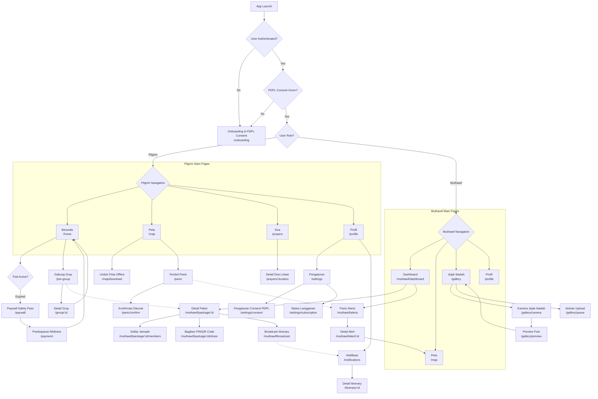

# User Flow — Haramain Pro (Mobile App)

```mermaid
graph TD
  %% Entry Points
  Start["App Launch"]
  Start --> AuthCheck{User Authenticated?}
  AuthCheck -->|No| Onboarding
  AuthCheck -->|Yes| ConsentCheck{PDPL Consent Given?}

  Onboarding["Onboarding & PDPL Consent<br/>/onboarding"]
  ConsentCheck -->|No| Onboarding
  ConsentCheck -->|Yes| RoleCheck{User Role?}

  %% Role Routing
  RoleCheck -->|Pilgrim| NavContainerPilgrim
  RoleCheck -->|Muthawif| NavContainerMuthawif

  %% ===================
  %% PILGRIM USER FLOW
  %% ===================

  %% Navigation Container for Pilgrims
  NavContainerPilgrim{Pilgrim Navigation}

  subgraph "Pilgrim Main Pages"
    NavContainerPilgrim --> Home["Beranda<br/>/home"]
    NavContainerPilgrim --> Map["Peta<br/>/map"]
    NavContainerPilgrim --> Doa["Doa<br/>/prayers"]
    NavContainerPilgrim --> Profile["Profil<br/>/profile"]
  end

  %% Home Page Sub-flows
  Home --> TrialStatus{Trial Active?}
  TrialStatus -->|Expired| Paywall["Paywall Safety Pass<br/>/paywall"]
  Paywall --> Payment["Pembayaran Midtrans<br/>/payment"]
  Payment --> Home

  Home --> JoinGroup["Gabung Grup<br/>/join-group"]
  JoinGroup --> GroupDetail["Detail Grup<br/>/group/:id"]
  GroupDetail --> Home

  %% Map Page Sub-flows
  Map --> DownloadMaps["Unduh Peta Offline<br/>/map/download"]
  Map --> PanicButton["Tombol Panic<br/>/panic"]
  PanicButton --> PanicConfirm["Konfirmasi Darurat<br/>/panic/confirm"]

  %% Prayers Page Sub-flows
  Doa --> PrayerDetail["Detail Doa Lokasi<br/>/prayers/:location"]

  %% Profile Page Sub-flows
  Profile --> Settings["Pengaturan<br/>/settings"]
  Settings --> ConsentSettings["Pengaturan Consent PDPL<br/>/settings/consent"]
  Settings --> SubscriptionStatus["Status Langganan<br/>/settings/subscription"]

  Profile --> Notifications["Notifikasi<br/>/notifications"]
  Notifications --> ItineraryDetail["Detail Itinerary<br/>/itinerary/:id"]

  %% ===================
  %% MUTHAWIF USER FLOW
  %% ===================

  %% Navigation Container for Muthawif
  NavContainerMuthawif{Muthawif Navigation}

  subgraph "Muthawif Main Pages"
    NavContainerMuthawif --> MuthawifHome["Dashboard<br/>/muthawif/dashboard"]
    NavContainerMuthawif --> MuthawifMap["Peta<br/>/map"]
    NavContainerMuthawif --> Gallery["Jejak Ibadah<br/>/gallery"]
    NavContainerMuthawif --> MuthawifProfile["Profil<br/>/profile"]
  end

  %% Muthawif Dashboard Sub-flows
  MuthawifHome --> PackageDetail["Detail Paket<br/>/muthawif/package/:id"]
  PackageDetail --> MembersList["Daftar Jamaah<br/>/muthawif/package/:id/members"]
  PackageDetail --> SharePin["Bagikan PIN/QR Code<br/>/muthawif/package/:id/share"]
  PackageDetail --> BroadcastItinerary["Broadcast Itinerary<br/>/muthawif/broadcast"]

  MuthawifHome --> AlertsReceived["Panic Alerts<br/>/muthawif/alerts"]
  AlertsReceived --> AlertDetail["Detail Alert<br/>/muthawif/alert/:id"]
  AlertDetail --> MuthawifMap

  %% Gallery Sub-flows
  Gallery --> CameraCapture["Kamera Jejak Ibadah<br/>/gallery/camera"]
  CameraCapture --> PhotoPreview["Preview Foto<br/>/gallery/preview"]
  PhotoPreview --> Gallery

  Gallery --> UploadQueue["Antrian Upload<br/>/gallery/queue"]

  %% Cross-connections
  JoinGroup -.-> PackageDetail
  BroadcastItinerary -.-> Notifications
  PanicButton -.-> AlertsReceived
```
