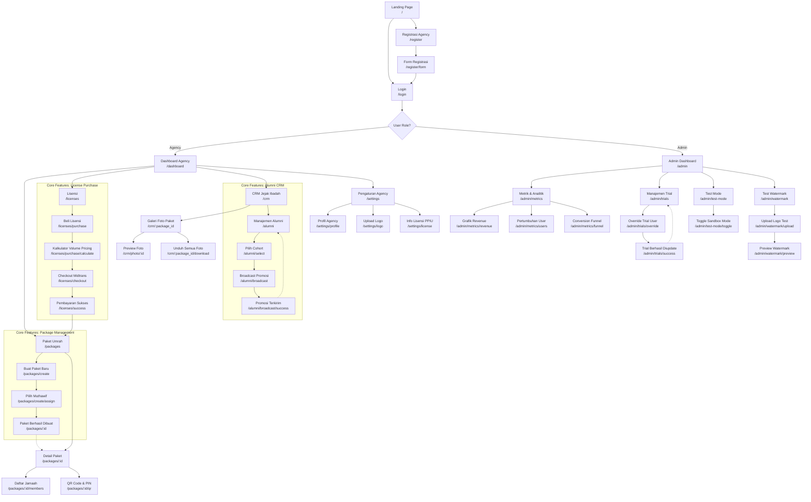

# User Flow — Haramain Pro (Web Dashboard)

```mermaid
graph TD
  %% Entry Points
  Start["Landing Page<br/>/"]
  Start --> Login["Login<br/>/login"]
  Start --> Register["Registrasi Agency<br/>/register"]

  Register --> RegisterForm["Form Registrasi<br/>/register/form"]
  RegisterForm --> Login

  Login --> RoleCheck{User Role?}
  RoleCheck -->|Agency| AgencyDashboard
  RoleCheck -->|Admin| AdminDashboard

  %% ===================
  %% AGENCY USER FLOW
  %% ===================

  %% Primary Pages
  AgencyDashboard["Dashboard Agency<br/>/dashboard"]
  Packages["Paket Umrah<br/>/packages"]
  Licenses["Lisensi<br/>/licenses"]
  CRM["CRM Jejak Ibadah<br/>/crm"]
  AgencySettings["Pengaturan Agency<br/>/settings"]

  AgencyDashboard --> Packages
  AgencyDashboard --> Licenses
  AgencyDashboard --> CRM
  AgencyDashboard --> AgencySettings

  %% License Purchase Flow
  subgraph "Core Features: License Purchase"
    Licenses --> PurchaseLicense["Beli Lisensi<br/>/licenses/purchase"]
    PurchaseLicense --> PricingCalculator["Kalkulator Volume Pricing<br/>/licenses/purchase/calculate"]
    PricingCalculator --> CheckoutB2B["Checkout Midtrans<br/>/licenses/checkout"]
    CheckoutB2B --> PaymentSuccess["Pembayaran Sukses<br/>/licenses/success"]
  end

  PaymentSuccess --> Packages

  %% Package Management Flow
  subgraph "Core Features: Package Management"
    Packages --> CreatePackage["Buat Paket Baru<br/>/packages/create"]
    CreatePackage --> AssignMuthawif["Pilih Muthawif<br/>/packages/create/assign"]
    AssignMuthawif --> PackageCreated["Paket Berhasil Dibuat<br/>/packages/:id"]
  end

  Packages --> PackageDetail["Detail Paket<br/>/packages/:id"]
  PackageDetail --> PackageMembers["Daftar Jamaah<br/>/packages/:id/members"]
  PackageDetail --> PackageQR["QR Code & PIN<br/>/packages/:id/qr"]

  %% CRM & Photo Gallery Flow
  CRM --> PackageGallery["Galeri Foto Paket<br/>/crm/:package_id"]
  PackageGallery --> PhotoViewer["Preview Foto<br/>/crm/photo/:id"]
  PackageGallery --> BulkDownload["Unduh Semua Foto<br/>/crm/:package_id/download"]

  %% Alumni Management Flow
  subgraph "Core Features: Alumni CRM"
    CRM --> AlumniManagement["Manajemen Alumni<br/>/alumni"]
    AlumniManagement --> SelectCohorts["Pilih Cohort<br/>/alumni/select"]
    SelectCohorts --> BroadcastPromo["Broadcast Promosi<br/>/alumni/broadcast"]
    BroadcastPromo --> BroadcastSent["Promosi Terkirim<br/>/alumni/broadcast/success"]
  end

  %% Agency Settings Flow
  AgencySettings --> ProfileSettings["Profil Agency<br/>/settings/profile"]
  AgencySettings --> LogoUpload["Upload Logo<br/>/settings/logo"]
  AgencySettings --> LicenseInfo["Info Lisensi PPIU<br/>/settings/license"]

  %% ===================
  %% ADMIN USER FLOW
  %% ===================

  %% Primary Admin Pages
  AdminDashboard["Admin Dashboard<br/>/admin"]
  Metrics["Metrik & Analitik<br/>/admin/metrics"]
  TrialManagement["Manajemen Trial<br/>/admin/trials"]
  TestMode["Test Mode<br/>/admin/test-mode"]
  WatermarkTest["Test Watermark<br/>/admin/watermark"]

  AdminDashboard --> Metrics
  AdminDashboard --> TrialManagement
  AdminDashboard --> TestMode
  AdminDashboard --> WatermarkTest

  %% Admin Metrics Flow
  Metrics --> RevenueCharts["Grafik Revenue<br/>/admin/metrics/revenue"]
  Metrics --> UserGrowth["Pertumbuhan User<br/>/admin/metrics/users"]
  Metrics --> ConversionFunnel["Conversion Funnel<br/>/admin/metrics/funnel"]

  %% Trial Management Flow
  TrialManagement --> TrialOverride["Override Trial User<br/>/admin/trials/override"]
  TrialOverride --> TrialUpdated["Trial Berhasil Diupdate<br/>/admin/trials/success"]

  %% Test Mode Flow
  TestMode --> ToggleSandbox["Toggle Sandbox Mode<br/>/admin/test-mode/toggle"]

  %% Watermark Testing Flow
  WatermarkTest --> UploadTestLogo["Upload Logo Test<br/>/admin/watermark/upload"]
  UploadTestLogo --> PreviewWatermark["Preview Watermark<br/>/admin/watermark/preview"]

  %% Cross-connections
  PackageCreated -.-> PackageDetail
  BroadcastSent -.-> AlumniManagement
  TrialUpdated -.-> TrialManagement
```
